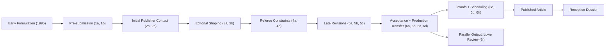

# Process And Influence Map

## Process Graph

## Actor Model

- Undo Uus: principal author and reviser.
- Keith Sutherland: publisher and key editorial strategist.
- Anthony Freeman: managing editor for production/proofs.
- Benjamin Libet: editorial gate in acceptance phase.
- Joseph Goguen: editor-in-chief in acceptance path.
- External philosophical inputs: Beloff, Hut, Kane, Sprigge, others via review/correspondence.

## Mental Model Of Connections

- Manuscript files (`*b`, plus `6d`) show doctrinal content evolution.
- Publishing files (`*a`, `6c`, `6e`, `6g`, `6h`) explain *why* each transition happened.
- Final article and covers show public-facing output.
- Responses dossier tests whether the argument was understood and how it propagated.
